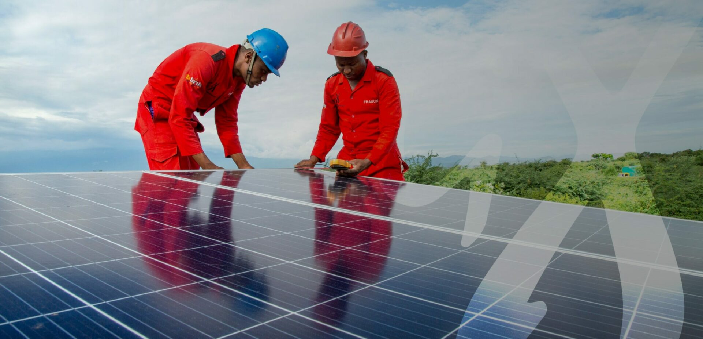

# SPACETRIC WEBSITE - IMAGE INVENTORY & REPLACEMENT GUIDE

## 🖼️ PRIORITY BRAND IMAGES TO REPLACE

### **MAIN LOGO FILES**
```
📁 Primary Logos (MUST REPLACE)
/wp-content/uploads/2023/11/GX-Logo.png
/wp-content/uploads/2022/10/GX-color.svg  
/wp-content/uploads/2022/11/favicon.png
/wp-content/uploads/2023/11/GX-banner.jpg
/wp-content/uploads/2022/10/GX-home-image-scaled.jpg
```

### **FREEDOM WON ETOWER PROMOTIONAL**
```
📁 Product Promotion (UPDATE BRANDING)
/wp-content/uploads/2024/09/FW-Digital-Logo-white-300x23.png
```

### **PROJECT CASE STUDY IMAGES** 
*(Contain "Gadgetronix" branding - 50+ images)*
```
📁 2022 Project Images (REBRAND REQUIRED)
/wp-content/uploads/2022/10/lahia-temted-lodge-gadgetronix.005.jpg
/wp-content/uploads/2022/10/kubukubu-gadgetronix-web.006.jpg
/wp-content/uploads/2022/10/maramboi-gadgetronix-web.005.jpg
/wp-content/uploads/2022/10/kahawa-house-gadgetronix.006.jpg
/wp-content/uploads/2022/10/maramara-lodge-gadgetronix.007.jpg
/wp-content/uploads/2022/10/lions-paw-camp-project-gadgetronix.003.jpg
/wp-content/uploads/2022/10/burunge-gadgetronix-project-web.008.jpg

... [50+ more project images with Gadgetronix branding]
```

## 📋 IMAGE REPLACEMENT STRATEGY

### **Method 1: Direct File Replacement**
1. Create new Spacetric-branded images
2. Save with identical filenames  
3. Replace existing files
4. Website automatically updates

### **Method 2: Update References**
1. Create new images with new names
2. Update HTML/CSS references
3. More work but cleaner approach

## 🎨 RECOMMENDED NEW IMAGE FILES

### **Essential Brand Assets**
```
📁 Create These Files:
/wp-content/uploads/spacetric/
├── SPACETRIC-Logo.png (replace GX-Logo.png)
├── SPACETRIC-color.svg (replace GX-color.svg)
├── spacetric-banner.jpg (replace GX-banner.jpg)  
├── spacetric-home-image.jpg (replace GX-home-image-scaled.jpg)
├── spacetric-favicon.png (replace favicon.png)
└── certificates/
    ├── spacetric-iso-certificate.pdf
    └── spacetric-certifications.jpg
```

### **Project Portfolio Images**
```
📁 Rebrand These Project Files:
OLD: lahia-temted-lodge-gadgetronix.005.jpg
NEW: lahia-tented-lodge-spacetric.005.jpg

OLD: kubukubu-gadgetronix-web.006.jpg  
NEW: kubukubu-spacetric-web.006.jpg

OLD: maramboi-gadgetronix-web.005.jpg
NEW: maramboi-spacetric-web.005.jpg

... [Pattern continues for all 50+ project images]
```

## 📊 CURRENT IMAGE ANALYSIS

### **Total Images Found**: 500+ files
**Brand-Related Images**: 80+ files  
**Product Images**: 300+ files (generic, no rebrand needed)
**Project Case Studies**: 50+ files (rebrand required)
**Logos & Branding**: 5 critical files (immediate replacement)

## 🔧 TECHNICAL IMPLEMENTATION

### **High-Impact Image Locations in HTML**
```html
<!-- Main Logo (Line 285) -->


<!-- Banner Images -->
<meta property="og:image" content="wp-content/uploads/2023/11/GX-banner.jpg" />

<!-- Home Page Hero -->


<!-- Favicon -->
<link rel="icon" href="wp-content/uploads/2022/11/favicon.png" />
```

### **CSS References to Update**
```css
/* Look for brand-specific backgrounds */
.header-logo { background-image: url('uploads/2023/11/GX-Logo.png'); }
.hero-banner { background-image: url('uploads/2023/11/GX-banner.jpg'); }
```

## 🚀 QUICK REPLACEMENT GUIDE

### **Step 1: Replace Core Brand Files**
```bash
# Replace main logo
cp your-spacetric-logo.png /app/gadgetronix.net/wp-content/uploads/2023/11/GX-Logo.png

# Replace banner  
cp your-spacetric-banner.jpg /app/gadgetronix.net/wp-content/uploads/2023/11/GX-banner.jpg

# Replace color SVG
cp your-spacetric-color.svg /app/gadgetronix.net/wp-content/uploads/2022/10/GX-color.svg

# Replace favicon
cp your-spacetric-favicon.png /app/gadgetronix.net/wp-content/uploads/2022/11/favicon.png

# Replace home hero image  
cp your-spacetric-home-image.jpg /app/gadgetronix.net/wp-content/uploads/2022/10/GX-home-image-scaled.jpg
```

### **Step 2: Batch Rename Project Files**
```bash
# Create renamed copies of project images
cd /app/gadgetronix.net/wp-content/uploads/2022/10/

# Example for one project
cp lahia-temted-lodge-gadgetronix.005.jpg lahia-tented-lodge-spacetric.005.jpg
```

## 📝 IMAGE SPECS RECOMMENDATIONS

### **Logo Requirements**
- **Format**: PNG with transparent background
- **Size**: 400x113 pixels (matching current)
- **Usage**: Website header, documents, social media

### **Banner Requirements**  
- **Format**: JPG
- **Size**: 1500x843 pixels (matching current)
- **Usage**: Social media sharing, hero backgrounds

### **Favicon Requirements**
- **Format**: PNG  
- **Size**: 32x32 pixels (minimum), 192x192 (recommended)
- **Usage**: Browser tabs, mobile shortcuts

## 🎯 PRIORITY ORDER FOR REPLACEMENT

### **Phase 1: Immediate (Brand Visibility)**
1. Main website logo (header)
2. Social media banner image
3. Favicon  
4. Homepage hero image

### **Phase 2: Short-term (Content Pages)**  
1. About page company images
2. Contact page visuals
3. Service page headers

### **Phase 3: Medium-term (Portfolio)**
1. Project case study images
2. Client testimonial graphics  
3. Certificate images
4. Team photos

### **Phase 4: Long-term (Archive)**
1. Blog post images
2. Historical project photos
3. Document templates
4. Presentation materials

---

## 📞 NOTES FOR USER

**Your Action Required**:
1. **Provide new Spacetric logo files** in the formats specified above
2. **Specify brand colors** for any graphics that need color updating  
3. **Review project images** - decide which need rebranding vs. replacement
4. **Priority feedback** - which images are most important to you

**Current Status**: Image inventory complete, ready for your branded assets

**Files Ready for Replacement**: 5 core brand files + 50+ project images